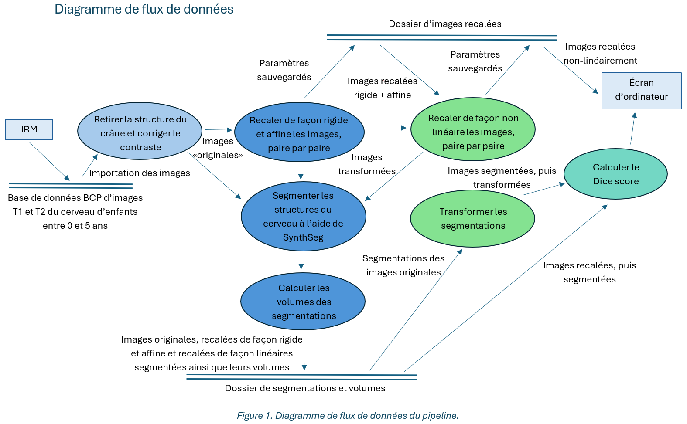

# Pipeline d'analyse d'images IRM du cerveau en pédiatrie

## Table des matières
* [Objectif](#objectif)
* [Schéma explicatif](#schéma-explicatif)
* [Utilisation du pipeline](#utilisation-du-pipeline)
* [Analyse des résultats](#analyse-des-résultats)
* [Dépendances](#dépendances)
* [Auteure](#auteure)

---

## Objectif

Le développement d’outils de recalage spatial robustes est essentiel pour soutenir l’analyse longitudinale du développement cérébral pendant la période critique de myélinisation rapide chez l’enfant (0–12 mois).

Ce projet vise à développer et valider un pipeline générique pour le recalage longitudinal d’IRM T1 pondérées (T1w) acquises à différents âges. L’évaluation de la robustesse du pipeline repose sur la comparaison des segmentations cérébrales produites avec **SynthSeg**, un modèle d’apprentissage profond indépendant du contraste.

Le pipeline permet de traiter plusieurs sujets, chacun scanné à différents temps (ex: 3, 6, 10 mois), et propose trois niveaux de recalage :
- Recalage rigide
- Recalage rigide + affine
- Recalage non-linéaire (SyN)


---

## Schéma explicatif

> 

---

## Utilisation du pipeline

Les scripts présentés ici sont pour le sujet 879509, mais il ne suffit que de remplacer le numéro du patient, les paires d'âges correspondantes, ainsi que les chemins d'accès dans les scripts afin de les adapter.

### 1. Recalage des IRM T1w

```bash
python rig_only.py        # Recalage rigide
python rig_aff.py         # Recalage rigide + affine + champ
python reg_nonlin.py      # Recalage non-linéaire SyN
python apply_nonlin.py    # Application des champs SyN
```

### 2. Segmentation avec SynthSeg

```bash
bash seg_orig.sh          # Sur images originales
bash seg_rig.sh           # Sur images rigides (_rigid_Warped)
bash seg_rigaff.sh        # Sur images rigide+affine (_Warped)
bash seg_nonlin.sh        # Sur images non-linéaires (_syn_Warped)
```

### 3. Application des transformations sur segmentations

```bash
python align_rig_aff_seg.py   # Appliquer matrice rigide/affine aux segmentations SynthSeg originales
python align_nonlin_seg.py    # Appliquer champ SyN sur les segmentations alignées
```

### 4. Évaluation des segmentations

```bash
python dice_base.py       # Dice entre segmentation rig_aff directe vs transformée
python dice_nonlin.py     # Dice entre segmentation nonlin directe vs transformée
```

### 5. Analyse des volumes

```bash
python graph_vol.py       # Volume par structure pour natif, rigide, affine, non-linéaire
python graph_dice.py      # Comparaison Dice global rigide/affine vs non-linéaire
```

---

## Analyse des résultats

- Les **scores de Dice par label** et les **volumes segmentés** sont extraits pour chaque méthode.
- Résultats sauvegardés dans `sub-879509/` :
  - `dice_scores_by_label.csv` et `dice_scores_nonlin_by_label.csv`
  - `comparaison_dice_scores_global.png` : barplot résumé
  - `comparaison_volumes_synthseg_quatre_niveaux.csv`
  - `volumes_*.png` : courbes de volumes par groupe

---

## Dépendances

- Python ≥ 3.7
- Packages : `numpy`, `scipy`, `pandas`, `nibabel`, `matplotlib`
- Outils externes :
  - [ANTs](https://github.com/ANTsX/ANTs) (antsRegistration, antsApplyTransforms)
  - [SynthSeg](https://surfer.nmr.mgh.harvard.edu/fswiki/SynthSeg) (`mri_synthseg`)

---

## Auteure

**Camille Lortie**  
Projet réalisé dans le cadre du cours **GBM3100 – Projet individuel en génie biomédical**, hiver 2025  
Polytechnique Montréal# infant-longitudinal-registration
